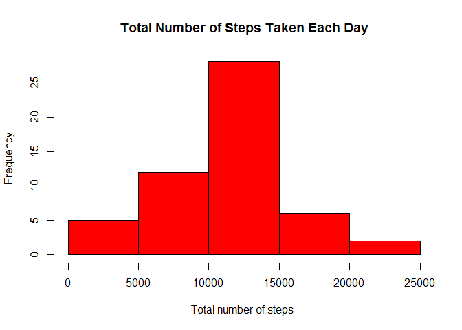
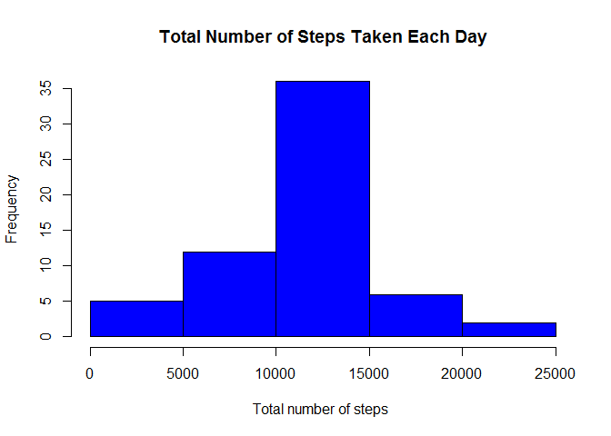
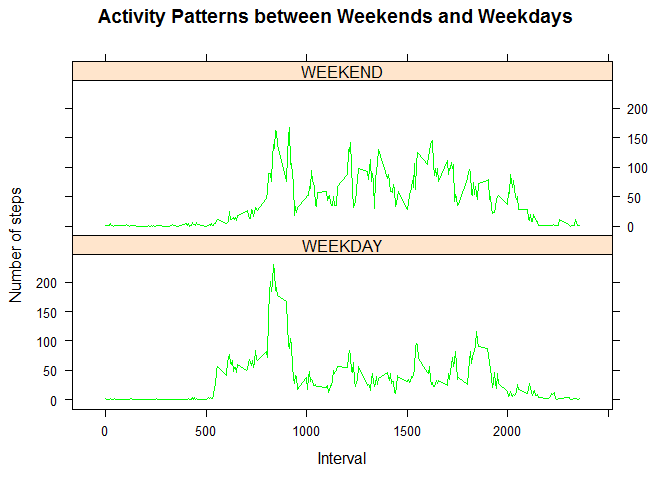

# Reproducible Research: Peer Assessment 1
#Loading library knitr,ggplot2 and dplyr

```r
library(knitr)
```

```
## Warning: package 'knitr' was built under R version 3.2.2
```

```r
library(dplyr)
```

```
## 
## Attaching package: 'dplyr'
## 
## The following objects are masked from 'package:stats':
## 
##     filter, lag
## 
## The following objects are masked from 'package:base':
## 
##     intersect, setdiff, setequal, union
```

```r
library(lubridate)
library(lattice)
```

## Loading and preprocessing the data

```r
activity_dat <- read.csv("activity.csv", header = TRUE, sep = ",")
tidy_dat <- activity_dat[!is.na(activity_dat$steps),]
```


## What is mean total number of steps taken per day?


```r
##Calculate the total number of steps taken per day
groupbydate <- group_by(tidy_dat, date)
sumdata <- summarise_each(groupbydate, funs(sum(steps)))
sumdata
```

```
## Source: local data frame [53 x 3]
## 
##          date steps interval
## 1  2012-10-02   126      126
## 2  2012-10-03 11352    11352
## 3  2012-10-04 12116    12116
## 4  2012-10-05 13294    13294
## 5  2012-10-06 15420    15420
## 6  2012-10-07 11015    11015
## 7  2012-10-09 12811    12811
## 8  2012-10-10  9900     9900
## 9  2012-10-11 10304    10304
## 10 2012-10-12 17382    17382
## ..        ...   ...      ...
```

```r
hist(sumdata$steps, main="Total Number of Steps Taken Each Day", 
     xlab="Total number of steps ", col="red")
```

 

```r
##Calculate and report the mean and median of the total number of steps taken per day
meandata <- mean(sumdata$steps)
meandata
```

```
## [1] 10766.19
```

```r
mediandata <- median(sumdata$steps)
mediandata
```

```
## [1] 10765
```
## What is the average daily activity pattern?


```r
groupbyint <- group_by(tidy_dat,interval)
Avginterval <- summarise_each(groupbyint, funs(mean(steps)))
plot(steps ~ interval, data = Avginterval, type = "l")
```

 

```r
##which interval,contains max no. of steps
  
Maxinterval <- Avginterval[which.max(Avginterval$steps),c("interval")]
Maxinterval
```

```
## Source: local data frame [1 x 1]
## 
##   interval
## 1      835
```


## Imputing missing values

```r
##Calculate and report the total number of missing values in the dataset 
missing_dat <- activity_dat[is.na(activity_dat$steps),]
totalna <- nrow(missing_dat)
totalna
```

```
## [1] 2304
```

```r
##Using mean of the interval to imput missing values
groupbyint <- group_by(tidy_dat,interval)
Avginterval <- summarise_each(groupbyint, funs(mean(steps)))
missing_dat[,1] <- Avginterval$steps
Imputdata <- rbind(tidy_dat, missing_dat)
Imputdata$date <- as.Date(Imputdata$date, "%Y-%m-%d")
Imputdata <- group_by(Imputdata, date)

##Calculate the total number of steps taken per day
sumdata <- summarise_each(Imputdata, funs(sum(steps)))
sumdata
```

```
## Source: local data frame [61 x 3]
## 
##          date    steps interval
## 1  2012-10-01 10766.19 10766.19
## 2  2012-10-02   126.00   126.00
## 3  2012-10-03 11352.00 11352.00
## 4  2012-10-04 12116.00 12116.00
## 5  2012-10-05 13294.00 13294.00
## 6  2012-10-06 15420.00 15420.00
## 7  2012-10-07 11015.00 11015.00
## 8  2012-10-08 10766.19 10766.19
## 9  2012-10-09 12811.00 12811.00
## 10 2012-10-10  9900.00  9900.00
## ..        ...      ...      ...
```

```r
hist(sumdata$steps, main="Total Number of Steps Taken Each Day", 
     xlab="Total number of steps ", col="blue")
```

 

```r
## Calculate and report the mean and median total number of steps taken per day
meandata <- mean(sumdata$steps)
meandata
```

```
## [1] 10766.19
```

```r
mediandata <- median(sumdata$steps)
mediandata
```

```
## [1] 10766.19
```


## Are there differences in activity patterns between weekdays and weekends?

```r
##create weekday & weekend
Imputdata$days <- weekdays(Imputdata$date)

daytype <- c("Monday","Tuesday", "Wednesday", "Thursday","Friday")

Imputdata$Day <- ifelse(is.element(Imputdata$days, daytype), "WEEKDAY", "WEEKEND")

myweek <- aggregate(Imputdata$steps, by = list(Imputdata$interval,Imputdata$Day),           mean)

names(myweek) <- c("interval", "weekdays", "steps")

xyplot(steps ~ interval | weekdays, myweek, type = "l", layout = c(1, 2), xlab = "Interval", ylab = "Number of steps", main = "Activity Patterns between Weekends and Weekdays", col = "green")
```

 

